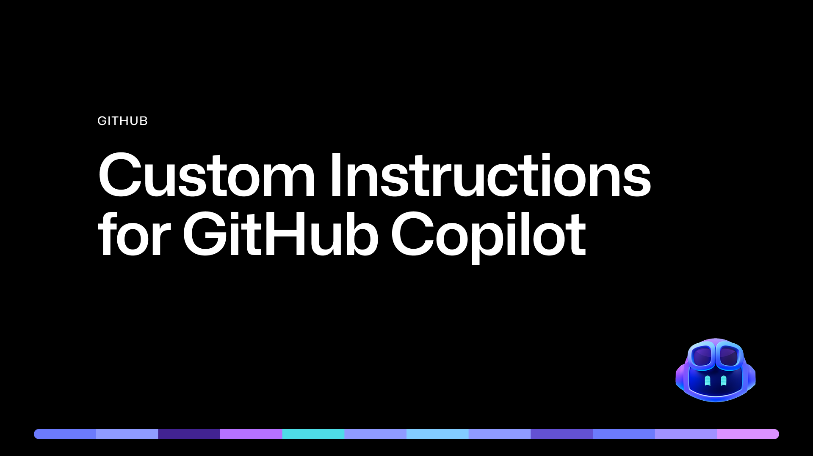
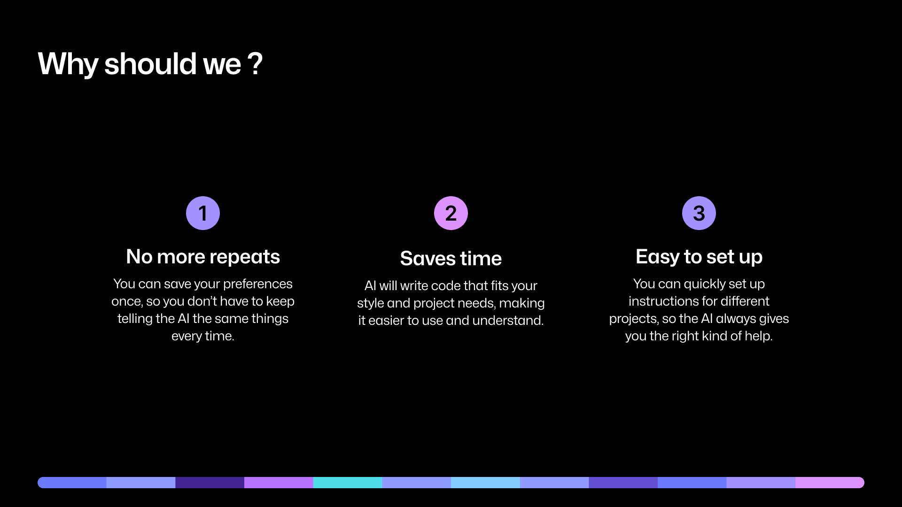

# Copilot Instructions Experiment

## Overview

This repository is a living experiment in customizing GitHub Copilot using repository-level instructions, prompt files and chat modes. Each branch in this repo demonstrates a specific Copilot customization or instruction, with a clear purpose and practical example. The goal is not to follow a strict tutorial, but to let you explore the capabilities and benefits of Copilot customization by switching between branches and seeing the impact of each change in context.

The **main** branch is a clean starting point, providing only this overview and a breakdown of the Copilot instruction concepts. All other branches add a specific instruction, prompt or architectural pattern, so you can see how Copilot adapts and assists as the project evolves.

## How to Use This Repo

1. **Start on `main`** to get the context and understand the motivation for customizing Copilot.
2. **Switch to any `part-*` branch** to see a focused experiment or instruction in action:
   - Each branch adds or refines a Copilot instruction, prompt file, or code pattern.
   - Review the Copilot instructions, prompt files, and code changes in that branch.
   - Try using Copilot Chat with the provided prompts and instructions to see how Copilot's suggestions and behavior change.
   - There is no required order—jump to any branch that interests you and see the effect of that customization.

## Branch Guide & Purpose

- **main**: The starting point. Contains only this overview and a breakdown of Copilot instruction concepts.
- **part-one/add-copilot-instructions**: Adds a `.github/copilot-instructions.md` file to set workspace-wide Copilot behavior and preferences.
- **part-two/add-copilot-prompts**: Introduces reusable prompt files (e.g., for code review, security checks) that can be invoked in Copilot Chat.
- **part-three/add-pokemon-blazor-project**: Adds a .NET Blazor project as a practical playground for Copilot customization.
- **part-four/add-task-specific-instruction**: Refines Copilot instructions to be more task-specific, guiding Copilot for particular coding tasks or workflows.
- **part-five/add-pokemons-page**: Implements a new Pokémons page in the Blazor app, using Copilot prompts and instructions to build a visually appealing gallery with PokeApiNet.
- **part-six/add-service-refactor-instruction**: Focuses on best practices for Blazor data services, refactoring prompts and instructions to encourage clean architecture and separation of concerns.
- **part-seven/add-service-refactor**: Implements the refactored services and updates Blazor components to use them, demonstrating Copilot's ability to assist with larger-scale refactoring guided by custom instructions.

## Customize Copilot....

Customizing Copilot at the repo level lets you:
- Set consistent coding style and workflow for your team or project.
- Create repeatable, task-specific Copilot chat commands with prompt files.
- Guide Copilot for real-world .NET/Blazor development, including UI, data fetching, and refactoring.
- See how Copilot responds to increasingly specific and complex instructions as your project grows.

## Learn More About Copilot Customization

GitHub Copilot can be tailored to your workflow and project needs. For a detailed overview of customization options, see:

- [Customize Copilot in VS Code – Official Docs](https://code.visualstudio.com/docs/copilot/copilot-customization)

This guide explains how to add repository-level instructions, create prompt files, and use chat modes to get the most out of Copilot in your development process.

Other resources:
- [GitHub Docs – Adding Repo Instructions](https://docs.github.com/en/copilot/how-tos/custom-instructions/adding-repository-custom-instructions-for-github-copilot)
- [MCP Servers for agent mode](https://code.visualstudio.com/mcp)
- [Sample Chat Mode File by Burke Holland](https://gist.github.com/burkeholland/a232b706994aa2f4b2ddd3d97b11f9a7)
- [PokeApiNet - A .Net wrapper for the Pokemon API](https://gist.github.com/burkeholland/a232b706994aa2f4b2ddd3d97b11f9a7)

**Each branch is a snapshot of Copilot customization at a different stage, with practical examples and lessons learned. Switch between branches to explore and experiment!**
